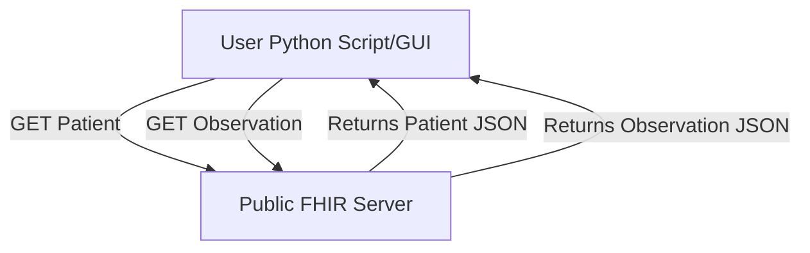

# FHIR API Integration Demo

## Overview
This demo shows how to connect to a public FHIR server, retrieve patient demographics and lab results, and understand the basics of healthcare interoperability using HL7 FHIR standards.

## Objectives
- Demonstrate FHIR API usage
- Fetch and display Patient and Observation resources
- Illustrate healthcare data interoperability

## Demo Options

### 1. Command-Line Fetch Demo (`api/fhir_fetch_demo.py`)
- **Purpose:** For technical users who want to see direct API usage, error handling, and sample data fallback.
- **How to Use:**
  ```bash
  pip install requests
  python api/fhir_fetch_demo.py
  ```
- **Output:** Prints patient demographics and lab results as JSON in the terminal. If the FHIR server is empty, loads sample data from the `examples/` folder.

### 2. GUI Demo (`api/fhir_gui_demo.py`)
- **Purpose:** For all audiences, especially non-technical stakeholders. Provides an interactive, user-friendly way to fetch and view FHIR data.
- **How to Use:**
  ```bash
  pip install requests
  python api/fhir_gui_demo.py
  ```
- **Features:**
  - Click a button to fetch a random patient and lab results
  - View results in two tabs: a clean summary and the raw JSON
  - Automatically falls back to sample data if the FHIR server is empty

## Setup & Usage
1. Ensure you have Python 3 and `requests` installed:
   ```bash
   pip install requests
   ```
2. Run either demo as described above.
3. Review the sample FHIR resources in the `examples/` folder.

## Data Flow Diagram


## References
- [HL7 FHIR Standard](https://www.hl7.org/fhir/)
- [HAPI FHIR Public Test Server](https://hapi.fhir.org/) 